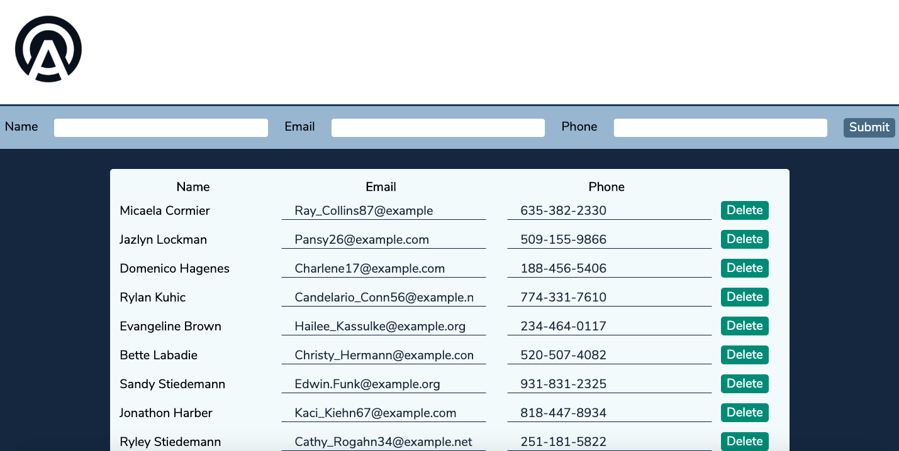

# Arcadia Power Contact Manager

The Aracida Power Contact manager is a full stack application built with a React/Redux front end and a Node back end (provided by Arcadia Power). Users are able to implement full CRUD with the app, with access to view all contact as well as add, update and delete any contact.

